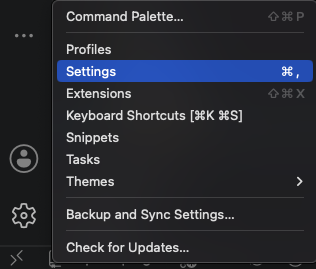
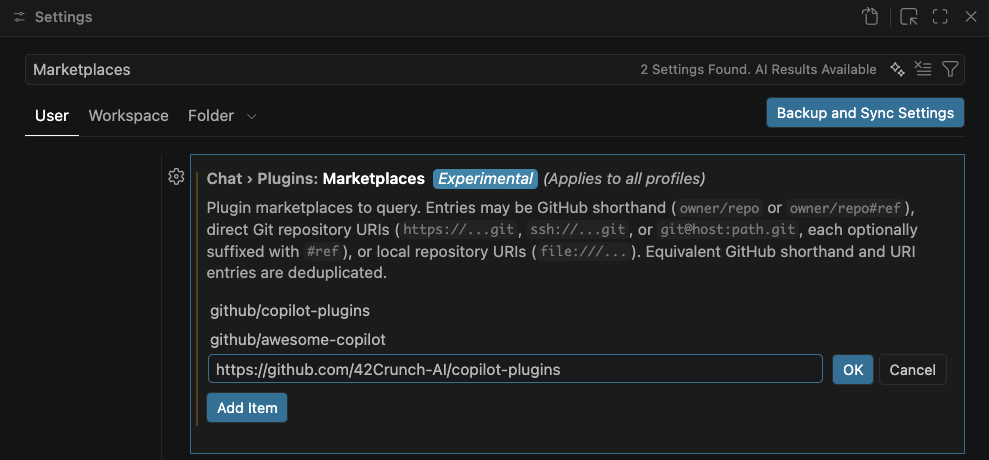
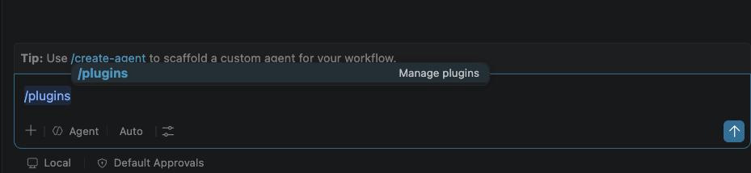
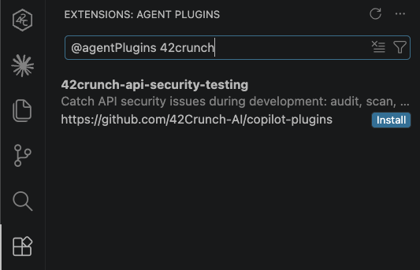

# 42Crunch GitHub Copilot Plugins

The official [42Crunch](https://www.42crunch.com) plugin marketplace for GitHub Copilot — a catalog of AI-powered plugins that bring 42Crunch's API security capabilities directly into your GitHub Copilot workflow.

42Crunch plugins give Copilot the ability to audit OpenAPI specs, scan live APIs for vulnerabilities, and apply fixes to ensure APIs meet security guardrails.

## Structure

```
.github/plugin/
  marketplace.json              # Plugin registry manifest
docs/                           # Repository-level documentation assets
  images/                       # Screenshots and diagrams used in READMEs
plugins/                        # GitHub Copilot plugins developed by 42Crunch
  42crunch-api-security-testing/
    .github/plugin/
      plugin.json                 # Plugin metadata
    skills/                     # Skill definitions
    references/                 # Reference definitions
    README.md                   # Documentation
    LICENSE                     # License
```

## Prerequisites

The [GitHub Copilot CLI](https://docs.github.com/en/copilot/github-copilot-in-the-cli/about-github-copilot-in-the-cli) is required to add marketplaces and install plugins using the `copilot` CLI commands below.

## Adding this Marketplace

Register the 42Crunch marketplace with GitHub Copilot:

#### Using GitHub Copilot CLI

```
copilot plugin marketplace add https://github.com/42Crunch-AI/copilot-plugins
```

#### Or Using an interactive GitHub Copilot session

```
/plugin marketplace add https://github.com/42Crunch-AI/copilot-plugins
```

#### Or Using GitHub Copilot Chat (for VSCode) plugin manager

1. Open the VSCode settings (Preferences > Settings):



2. Type 'Marketplaces' in the search
  - Click **Add Item** and paste the 42Crunch marketplace URL
  - `https://github.com/42Crunch-AI/copilot-plugins`
  - Click **OK**



## Available Plugins

### [42crunch-api-security-testing](./plugins/42crunch-api-security-testing/)

AI-powered API security plugin backed by 42Crunch. Audit OpenAPI specs, detect OWASP API Security vulnerabilities (including BOLA/BFLA), run live conformance and authorization scans against running APIs, and apply AI-assisted fixes — all through natural language.

**Install:**
After registering the marketplace (see above), install the plugin:

#### Using GitHub Copilot CLI

```
copilot plugin install 42crunch-api-security-testing@42crunch-marketplace
```

#### Or Using an interactive GitHub Copilot session

```
/plugin install 42crunch-api-security-testing@42crunch-marketplace
```

#### Or Using GitHub Copilot Chat (for VSCode) plugin manager

1. In GitHub Copilot Chat, type `/plugins` and press **Enter** to open the plugin manager:



2. Your VSCode extensions will appear in the Activity Bar, filtered on `@agentPlugins`

3. Search for the 42Crunch agent plugin:
  - Filter on '42crunch' in the search bar after the `@agentPlugins` prefix
  - Click **Install** on the `42crunch-api-security-testing` plugin



See the [plugin README](./plugins/42crunch-api-security-testing/README.md) for full documentation and [RECIPES.md](./plugins/42crunch-api-security-testing/RECIPES.md) for common scenario guides.


## Links

- [42Crunch](https://42crunch.com/)
- [42Crunch Documentation](https://docs.42crunch.com)
- [42Crunch on GitHub](https://github.com/42Crunch)
- Support: support@42crunch.com
